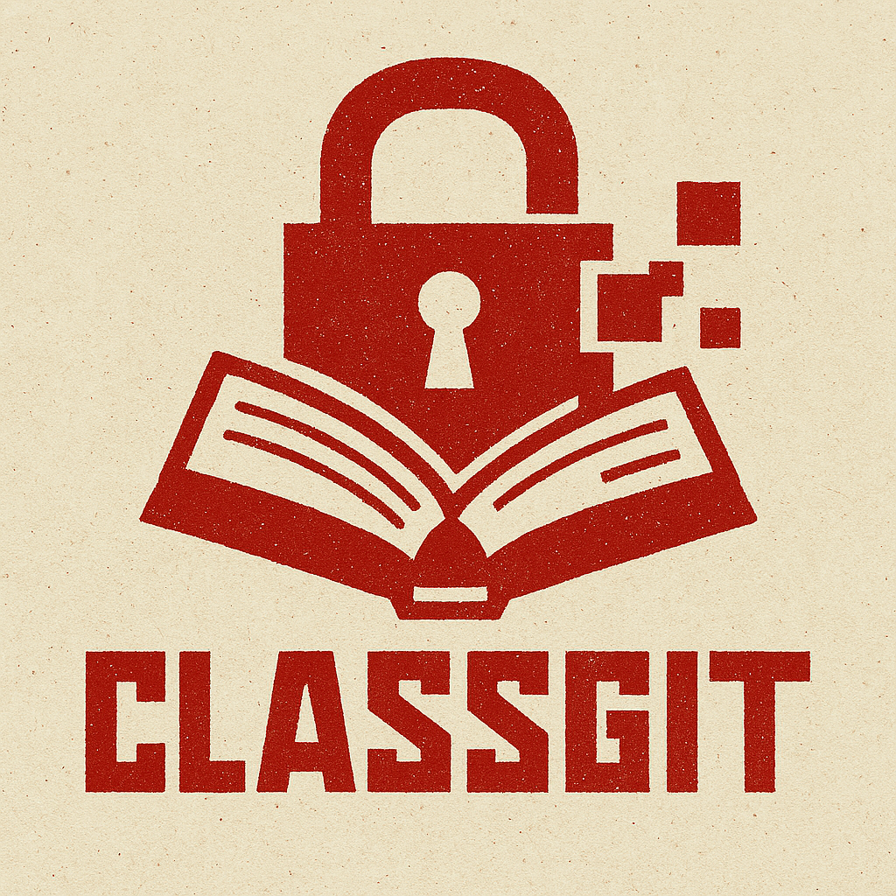

<p align="center">
  
</p>

ClassGit is a tool that allows you to **store your course files safely online, using Git, and Age to encrypt them**. Here, I'll use **GitHub** to show you around, because it's easier, but you can do this with any git configuration. Even if someone can access your Git repository, they cannot read your courses because all files are encrypted. This way, your courses are stored online, encrypted, and you can access them sefely and privately with any device.

This guide explains everything from installing required tools to pushing and pulling courses, with examples and explanations for each step.

---

## 1. Create a GitHub Account

1. Go to [GitHub](https://github.com/) and click **Sign up**.
2. Create a free account with a username, email, and password.
3. Once logged in, click **New Repository**.
4. Name it, for example, `mycourses`.
5. Set the repository to **Private**, so only you can see it (Even if your repo public all is encrypted, but it's better if the repositiory is set to Private).
6. Click **Create Repository**.

Your repository URL will look like this:

```
https://github.com/YourUsername/mycourses.git
```

You will use this URL in ClassGit to link your local folder to GitHub.

---

## 2. Install Required Tools

ClassGit relies on three tools:

* **Git** – to store and synchronize files on GitHub.
* **Age** – to encrypt and decrypt files.
* **Python 3** – to run the ClassGit script.

### Linux

```bash
sudo apt update
sudo apt install git age python3
```

### Windows

1. Download [Git](https://git-scm.com/downloads) and install it.
2. Download [Age](https://age-encryption.org/) and add it to your PATH.
3. Make sure Python 3 is installed.

---

## 3. Configure Git on Your Computer

Open a terminal (Linux) or Git Bash (Windows) and set your Git username and email:

```bash
git config --global user.name "Your Name"
git config --global user.email "your-email@example.com"
```

These settings link your commits to you.

---

## 4. Set Up ClassGit

1. Download the ClassGit folder with `classgit.py`.
2. Open a terminal in that folder.
3. Run the script:

```bash
python3 classgit.py
```

or

```bash
python3 classgit.py
```

The script will ask for your **GitHub repository URL** (example prompt):

```
Enter your GitHub repository URL (HTTPS):
```

Enter the URL of your repository, for example:

```
https://github.com/YourUsername/mycourses.git
```

After this, the script will:

* Create a local folder at `~/ClassGit` (Linux) or `C:\Users\YourName\ClassGit` (Windows).
* Create a `config` folder with your **private encryption key** (`age_key.txt`).
* Create a `courses` folder where you will put all your course files.
* Initialize a Git repository linked to your GitHub repository.
* Store your GitHub URL locally, so you don’t need to type it again.

> The private key (`age_key.txt`) **is not pushed to the repo by default**. Keep it safe. Anyone with this key can decrypt your courses.

---

## 5. Understanding Keys: Public and Private

ClassGit uses **Age encryption**. You will need:

* **Private key**: Stored in `config/age_key.txt`. Never share this online. Keep it safe.
* **Public key**: Derived from the private key. You can share this safely. ClassGit uses it to **encrypt your files before pushing**.

Example: generate public key from your private key:

```bash
age-keygen -y -i ~/ClassGit/config/age_key.txt
```

The script will prompt for this public key every time you push:

*Note : in recents updates, the public key is stored on configuration so classgit don't ask for it every time.*

```
Enter your Age public key to encrypt courses:
```

You paste the public key here. The files will be encrypted using this key. **The original files remain unencrypted locally**. Only encrypted copies are pushed to GitHub.

---

## 6. Adding Your Courses

1. Place your course files in the `~/ClassGit/courses` folder.
2. Example folder structure:

```
~/ClassGit/
    courses/
        Math101.pdf
        PhysicsNotes.pdf
    config/
        age_key.txt
```

3. Run the script and select:

```
1. Push courses
```

4. Enter your **Age public key** when prompted. The script will:

* Encrypt the files temporarily.
* Add them to Git.
* Commit the changes.
* Push the encrypted files to GitHub.

The **local copies of your files remain unencrypted**, so you can read them normally.

---

## 7. Pull Courses on Another Computer

1. Copy your **private key** (`age_key.txt`) to the new computer:

*/!\ As said before, be careful with that.*

```
~/ClassGit/config/age_key.txt
```

2. Run the script and select:

```
2. Pull courses
```

The script will:

* Pull the encrypted files from Git repo. (= syncing the files **from** the repo **in** your local device)
* Decrypt them using your private key.
* Replace the `.age` files with your original course files.

Now your courses are available to read on the new computer.

---

## 8. Add a New Device

If you want to use ClassGit on a new computer:

1. Run the script on your original computer.
2. Select:

```
3. Add a new device
```

3. Enter the full path where you want to copy the key.
4. On the new computer, place the key in:

```
~/ClassGit/config/age_key.txt
```

You can now pull your courses securely.

---

## 9. Check Git Status

If you want to see which files are changed or ready to push, select:

```
4. Show Git status
```

This shows the standard Git status output. This is useful for troubleshooting or checking pending changes.

---

## 10. Important Notes

* Keep your **private key safe**. Anyone with this key can decrypt your courses.
* Use a **private GitHub repository**.
* ClassGit is designed for **personal use** only.
* Avoid very large files (>100 MB) or use Git LFS.
* Public key can be shared safely. Only your private key decrypts files.

---

## 11. Disclaimer

ClassGit is provided as-is for personal and educational use. By using it, you accept full responsibility for your data, computer, and any consequences of its use. The author is not liable for data loss, corruption, or damages, whether direct or indirect, resulting from the tool. ClassGit is intended to securely store and synchronize files you legally own; it is not for illegal sharing or bypassing institutional rules. Always backup your files and ensure you comply with applicable laws and your institution’s policies.